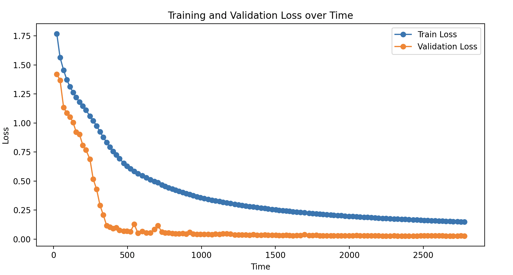

# Romanian-Graph2Phone

## Overview

This project implements a Grapheme-to-Phoneme (G2P) conversion system using a sequence-to-sequence model with attention. The model is trained on Romanian grapheme-phoneme pairs, utilizing both phoneme error rate (PER) and word error rate (WER) as evaluation metrics.

---

## Training Results

Below is a visualization of the training and validation loss over time:

- **Phoneme Error Rate (PER):** **0.728%**
- **Word Error Rate (WER):** **8.905%**

The model demonstrates a steady decrease in both training and validation loss, with the validation loss stabilizing at a low value, indicating effective generalization.

---

## Model Architecture

### Encoder
The encoder processes the grapheme sequence and generates a context-aware representation of the input. It uses:
- **Bidirectional RNN**: Captures both forward and backward dependencies in the sequence.
- **Input Size**: Determined by the dimensionality of the grapheme input.

### Decoder
The decoder generates the phoneme sequence conditioned on the encoder’s outputs. It incorporates:
- **Attention Mechanism**: Computes a weighted context vector based on encoder outputs and the decoder’s current state.
- **Teacher Forcing**: Balances between ground truth phoneme inputs and predicted phonemes during training.

### Attention Mechanism
Attention helps the decoder focus on relevant parts of the input sequence during each decoding step.

### Hyperparameters
- **Hidden Size**: Scaled for bidirectional input to double the dimensionality.
- **Learning Rate**: Dynamically decayed during training for stabilization.
- **Loss Function**: Cross-entropy loss computed on phoneme predictions.

---

## Training Details

The training process includes:
- **Dynamic Learning Rate Adjustment**: The learning rate is halved if validation loss plateaus for more than 4 consecutive steps.
- **Early Stopping**: Training stops if the learning rate falls below `1e-5`.
- **Batch Size**: Mini-batch gradient descent with a fixed size for efficient training.

---

## Test Results

Here are the results for test samples:

| Romanian Word | Predicted Phonemes        |
|---------------|---------------------------|
| bună          | b u n a t                |
| dimineață     | d i m i n ea ts at       |
| copac         | k o p a k                |
| pădure        | p at d u r e            |
| cer           | tS e r                  |
| coloreze      | k o l o r e z e         |
| soare         | s oa r e                |
| lună          | l u n at                |
| stea          | s t ea                  |
| floare        | f l oa r e              |

---

## Key Insights

1. **Strong Generalization**: Low validation loss and error rates indicate the model generalizes well on unseen data.
2. **Effective Attention Mechanism**: The attention mechanism enables the model to focus on relevant graphemes during decoding, improving accuracy.
3. **Training Challenges**: Slight overfitting during early epochs was mitigated with dropout and learning rate adjustments.
---